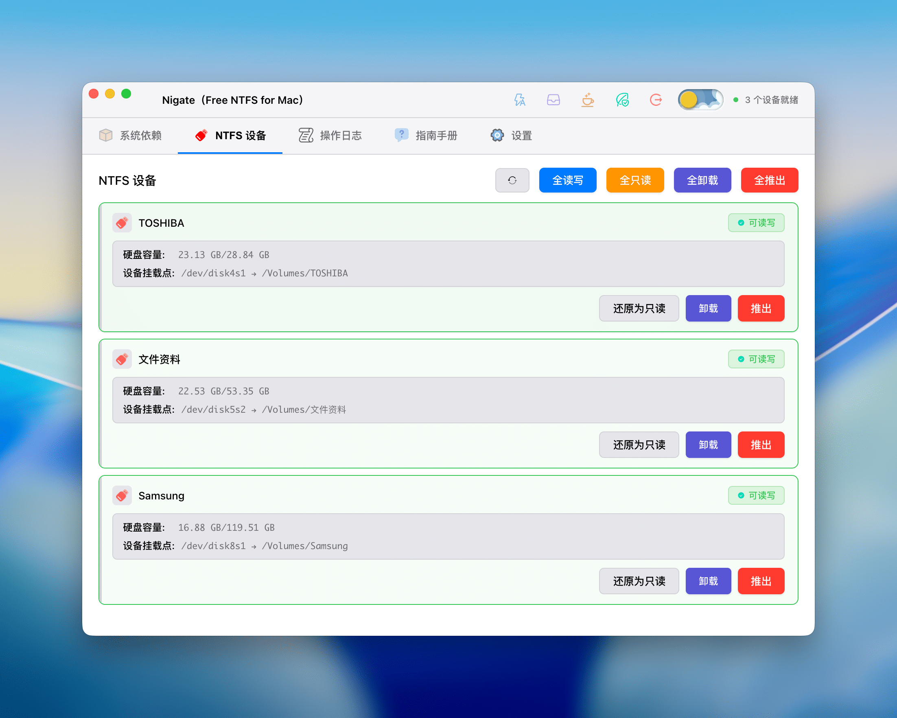

## English

This is the Electron GUI version of Nigate, which provides a modern and intuitive interface for NTFS device management while retaining the original geek terminal version.[^2]

### Features

- 🎨 **Modern Interface** - Dark theme with clean and beautiful design
- 📱 **Real-time Monitoring** - Automatically detects NTFS device connections
- ✅ **Dependency Check** - Automatically checks and installs required system dependencies
- 🔄 **One-Click Mount** - Easily mount read-only NTFS devices in read-write mode
- ⚡ **Auto Read-Write** - When enabled, newly inserted NTFS devices will be automatically mounted in read-write mode without manual operation. Intelligently skips devices you manually set to read-only, respecting your choices
- 📊 **Status Display** - Clearly displays device status and operation logs
- 🛡️ **Secure & Reliable** - Uses Electron security best practices
- ☕ **Prevent Sleep** - One-click toggle to prevent system sleep, ensuring the system stays awake during long operations
- 🍃 **Status Protection** - Long press for 3s to toggle protection status. When protected, auto read-write, tray mode, and prevent sleep features will be disabled to prevent accidental operations

### Important Notes


- **Administrator Privileges**: Mounting operations require administrator privileges, and the system will prompt for a password
- **Windows Fast Startup**: If the device uses Fast Startup in Windows, mounting may fail. It is recommended to fully shut down (not hibernate) in Windows, or disable Fast Startup
- **Device Name**: USB drive names do not support spaces or illegal characters
- **Gatekeeper (Allow Anywhere)**: First-time use may require disabling Gatekeeper to allow unsigned applications. Run in terminal: `sudo spctl --master-disable`. After disabling, you can see the "Anywhere" option in "System Settings" > "Privacy & Security"
- **System Integrity Protection (SIP)**: To disable SIP, you need to operate in Recovery Mode:
  1. Restart Mac, hold the power button until the Apple logo and progress bar appear, enter Recovery Mode
  2. Find and open Terminal from the toolbar at the top of the screen, enter command: `csrutil disable`
  3. Close Terminal and restart Mac
  4. After restart, you can run `csrutil status` in terminal to check the status

### Quick Start - Shell

#### Method 1: Online Experience

Copy and paste into a ***terminal with full administrative privileges*** and press Enter:

```shell
/bin/bash -c "$(curl -fsSL https://cdn.statically.io/gh/hoochanlon/Free-NTFS-for-Mac/main/ninja/nigate.sh)"
```

#### Method 2: Download Locally

After downloading, you can directly type `nigate` to start:

```shell
curl https://fastly.jsdelivr.net/gh/hoochanlon/Free-NTFS-for-Mac/ninja/nigate.sh > ~/Public/nigate.sh && sudo -S mkdir -p /usr/local/bin && cd /usr/local/bin && sudo ln -s ~/Public/nigate.sh nigate.shortcut && echo "alias nigate='bash nigate.shortcut'" >> ~/.zshrc && osascript -e 'tell application "Terminal" to do script "nigate"'
```

### Quick Start - GUI Version (Electron)

Download and use from [tags](https://github.com/hoochanlon/Free-NTFS-for-Mac/tags).

**Main Interface**



**Tray**


### Dependency Management

#### One-Click Install Dependencies

```shell
/bin/bash -c "$(curl -fsSL https://cdn.jsdelivr.net/gh/hoochanlon/Free-NTFS-for-Mac@main/ninja/kunai.sh)"
```

#### One-Click Uninstall Dependencies

```shell
/bin/bash -c "$(curl -fsSL https://cdn.jsdelivr.net/gh/hoochanlon/Free-NTFS-for-Mac@main/ninja/ninpo.sh)"
```

> For more information, see: [Ninja Tools Testing #39](https://github.com/hoochanlon/Free-NTFS-for-Mac/issues/39)

### Operations & Development

#### Installation Steps

1. **Clone and Initialize**

```bash
git clone <repository-url>
cd Free-NTFS-for-Mac
pnpm install
pnpm run setup  # One-click fix for common issues, initialize project
```

2. **Run Application**

```bash
pnpm start
```

Or development mode (automatically opens DevTools):

```bash
pnpm run dev
```

3. **Build Application**

```bash
pnpm run build
```

#### Project Setup Script

If you encounter errors with `pnpm run dev`, run the setup script to fix them:

```bash
pnpm run setup
```

Or run directly:

```bash
./ninja/setup.sh
```

This script automatically:
- ✅ Checks if required files exist
- ✅ Sets script execution permissions
- ✅ Creates necessary directory structure
- ✅ Syncs version numbers
- ✅ Compiles TypeScript and Stylus
- ✅ Verifies critical files

After building, you can find the packaged application in the `dist` directory.

### Mac Packaging Instructions

After packaging, the following will be generated in the `dist` directory:
- **DMG File**: Installation package for distribution
- **ZIP File**: Compressed application package

Other notes:
- Use `./ninja/build.sh` script for more flexible packaging
- First run may require right-clicking the application and selecting "Open" (macOS security restrictions)

### Troubleshooting

#### Mount Failure

1. Check if all dependencies are installed
2. Confirm the device is not occupied by other programs
3. If it's a Windows Fast Startup issue, fully shut down the device in Windows

#### Dependency Installation Failure

1. Ensure network connection is normal
2. Check if Homebrew is correctly installed
3. May need to manually run installation commands in terminal

#### Application Won't Start

1. Check if Node.js version meets requirements
2. Delete `node_modules` and rerun `pnpm install`
3. Check console error messages

### Acknowledgments

Thank you to all developers, testers, and users who have contributed to this project! See [ACKNOWLEDGMENTS.md](ACKNOWLEDGMENTS.md) for details.

[^2]: **Note**: Using this tool to mount or modify NTFS devices carries a risk of data loss. It is strongly recommended to backup important data before operation. This tool is provided "as is" without any warranty. The developer is not responsible for data loss caused by using this tool.

