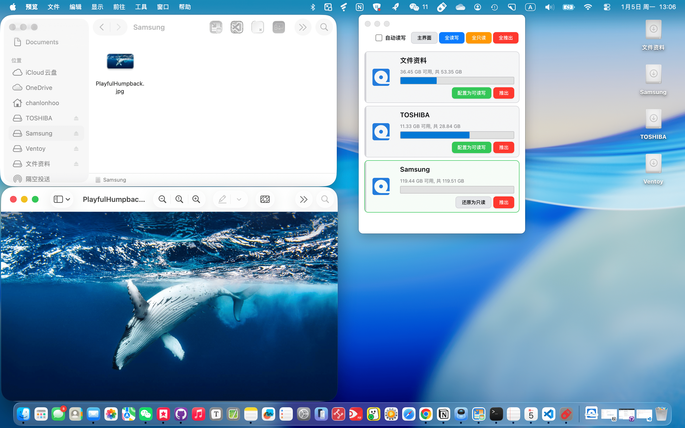

# Nigate

这是 Nigate 的 Electron 图形界面版本，在保留原有极客终端版本的同时，提供了现代化、直观的操作界面，让 NTFS 设备管理更加简单便捷。[^1]

## 功能特性

- 🎨 **现代化界面** - 采用深色主题，界面简洁美观
- 📱 **实时监控** - 自动检测 NTFS 设备接入
- ✅ **依赖检查** - 自动检查并安装所需系统依赖
- 🔄 **一键挂载** - 轻松将只读 NTFS 设备挂载为读写模式
- 📊 **状态显示** - 清晰显示设备状态和操作日志
- 🛡️ **安全可靠** - 使用 Electron 安全最佳实践

## 使用说明

### 首次使用

1. **检查系统依赖**
   - 打开应用后，点击"检查依赖"按钮
   - 系统会自动检查所需的依赖（Swift、Homebrew、MacFUSE、ntfs-3g）
   - 如果有缺失的依赖，点击"安装缺失依赖"按钮进行安装

2. **挂载 NTFS 设备**
   - 插入 NTFS 格式的移动存储设备
   - 应用会自动检测设备（每 5 秒刷新一次）
   - 对于只读设备，点击"挂载为读写"按钮
   - 输入管理员密码完成挂载

### 注意事项

- **管理员权限**：挂载操作需要管理员权限，系统会提示输入密码
- **Windows 快速启动**：如果设备在 Windows 中使用了快速启动功能，可能导致挂载失败。建议在 Windows 中完全关闭（而非休眠），或禁用快速启动功能
- **设备名称**：U盘名称不支持空格与非法字符
- **系统完整性保护**：首次使用可能需要禁用系统完整性保护（SIP），在终端运行：`sudo spctl --master-disable`

## 快速开始，两种方式，任选其一 （Shell）

[](https://github.com/hoochanlon/Free-NTFS-for-Mac/assets/35732922/8f2d3ced-62cb-4c08-912e-909321b3f1db)

一、在线体验，复制粘贴到 ***完全管理权限的终端*** 回车，一键起飞。


 ```shell
 /bin/bash -c "$(curl -fsSL https://cdn.statically.io/gh/hoochanlon/Free-NTFS-for-Mac/main/nigate.sh)"
 ```


二、下载到本地，往后开启可直接输入`nigate`

```shell
curl https://fastly.jsdelivr.net/gh/hoochanlon/Free-NTFS-for-Mac/nigate.sh > ~/Public/nigate.sh && sudo -S mkdir -p /usr/local/bin && cd /usr/local/bin && sudo ln -s ~/Public/nigate.sh nigate.shortcut && echo "alias nigate='bash nigate.shortcut'" >> ~/.zshrc && osascript -e 'tell application "Terminal" to do script "nigate"'
```

## 快速开始，图形化软件版（Electron）

下载使用，见[tags](https://github.com/hoochanlon/Free-NTFS-for-Mac/tags)





## 运维

### 安装步骤

1. **安装依赖**

```bash
pnpm install
```

2. **运行应用**

```bash
pnpm start
```

或开发模式（自动打开 DevTools）：

```bash
pnpm run dev
```

3. **构建应用**

```bash
pnpm run build
```

构建完成后，可在 `dist` 目录找到打包好的应用。

### Mac 打包说明

打包完成后，会在 `dist` 目录生成：
- **DMG 文件**：用于分发的安装包
- **ZIP 文件**：压缩的应用包

**其他打包选项**：
- 使用 `./build.sh` 脚本进行更灵活的打包
- 首次运行可能需要右键点击应用选择"打开"（macOS 安全限制）


## 开发

### 代码结构

- `main.js`: Electron 主进程，负责窗口管理和 IPC 通信
- `preload.js`: 安全桥接层，暴露安全的 API 给渲染进程
- `renderer.js`: 渲染进程逻辑，处理 UI 交互
- `ntfs-manager.js`: NTFS 设备管理核心，将原 shell 脚本逻辑转换为 Node.js 代码

### IPC 通信

应用使用 Electron 的 IPC（进程间通信）机制：

- `check-dependencies`: 检查系统依赖
- `get-ntfs-devices`: 获取 NTFS 设备列表
- `mount-device`: 挂载设备为读写模式
- `unmount-device`: 卸载设备
- `install-dependencies`: 安装缺失依赖

## 故障排除

### 挂载失败

1. 检查是否已安装所有依赖
2. 确认设备未被其他程序占用
3. 如果是 Windows 快速启动问题，请在 Windows 中完全关闭设备

### 依赖安装失败

1. 确保网络连接正常
2. 检查 Homebrew 是否正确安装
3. 可能需要手动在终端运行安装命令

### 应用无法启动

1. 检查 Node.js 版本是否符合要求
2. 删除 `node_modules` 并重新运行 `pnpm install`
3. 查看控制台错误信息


[^1]: 注：使用本工具挂载或修改 NTFS 设备存在数据丢失风险。强烈建议操作前备份重要数据。本工具按“现状”提供，不提供任何担保。因使用本工具造成的数据损失，开发者不承担责任。
