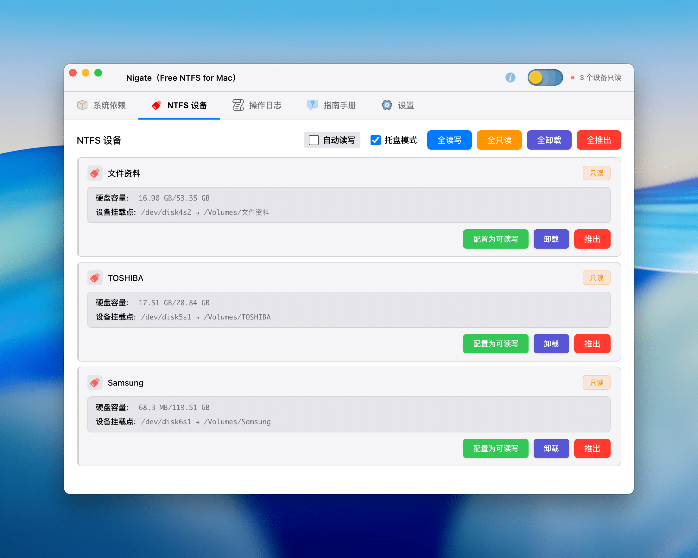
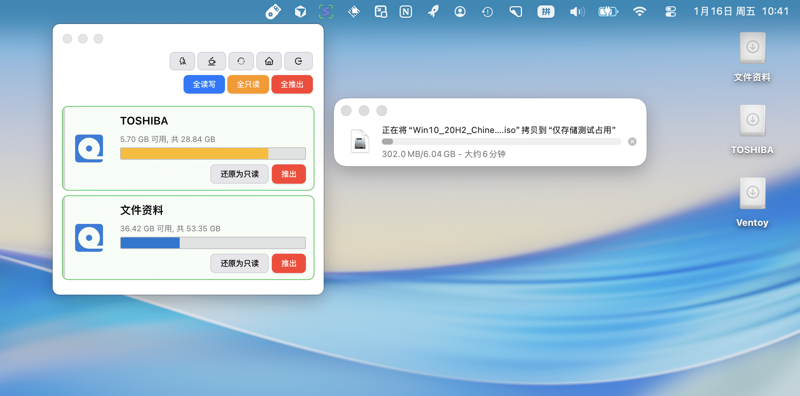

# Nigate

**Language / 言語 / 语言**: [English](#english) | [日本語](#日本語) | [中文](#中文)

---

<a name="中文"></a>
## 中文

这是 Nigate 的 Electron 图形界面版本，在保留原有极客终端版本的同时，提供了现代化、直观的操作界面，让 NTFS 设备管理更加简单便捷。[^1]

## 功能特性

- 🎨 **现代化界面** - 采用深色主题，界面简洁美观
- 📱 **实时监控** - 自动检测 NTFS 设备接入
- ✅ **依赖检查** - 自动检查并安装所需系统依赖
- 🔄 **一键挂载** - 轻松将只读 NTFS 设备挂载为读写模式
- 📊 **状态显示** - 清晰显示设备状态和操作日志
- 🛡️ **安全可靠** - 使用 Electron 安全最佳实践
- ☕ **防止休眠** - 一键开启/关闭系统休眠防止功能，确保长时间操作时系统保持唤醒状态

## 使用说明

### 首次使用

1. **检查系统依赖**
   - 打开应用后，点击"检查依赖"按钮
   - 系统会自动检查所需的依赖（Swift、Homebrew、MacFUSE、ntfs-3g）
   - 如果有缺失的依赖，点击"安装缺失依赖"按钮进行安装

2. **挂载 NTFS 设备**
   - 插入 NTFS 格式的移动存储设备
   - 应用会自动检测设备（每 5 秒刷新一次）
   - 对于只读设备，点击"挂载为读写"按钮
   - 输入管理员密码完成挂载

3. **防止休眠功能**
   - 在标题栏、主界面操作区域或托盘窗口中点击"防止休眠"按钮
   - 启用后，系统将保持唤醒状态，防止进入休眠模式
   - 适用于长时间文件传输或批量操作场景
   - 操作完成后可随时关闭，节省系统资源

### 注意事项

- **管理员权限**：挂载操作需要管理员权限，系统会提示输入密码
- **Windows 快速启动**：如果设备在 Windows 中使用了快速启动功能，可能导致挂载失败。建议在 Windows 中完全关闭（而非休眠），或禁用快速启动功能
- **设备名称**：U盘名称不支持空格与非法字符
- **Gatekeeper（允许任何来源）**：首次使用可能需要禁用 Gatekeeper 以允许运行未签名的应用。在终端运行：`sudo spctl --master-disable`。禁用后可在「系统设置」>「隐私与安全性」中看到「任何来源」选项
- **系统完整性保护（SIP）**：如需禁用 SIP，需要在恢复模式下操作：
  1. 重启 Mac，按住电源键直到屏幕上出现苹果的标志和进度条，进入 Recovery 模式
  2. 在屏幕上方的工具栏找到并打开终端，输入命令：`csrutil disable`
  3. 关掉终端，重启 Mac
  4. 重启以后可以在终端中运行 `csrutil status` 查看状态确认

## 快速开始，两种方式，任选其一 （Shell）

一、在线体验，复制粘贴到 ***完全管理权限的终端*** 回车，一键起飞。


 ```shell
 /bin/bash -c "$(curl -fsSL https://cdn.statically.io/gh/hoochanlon/Free-NTFS-for-Mac/main/ninja/nigate.sh)"
 ```

二、下载到本地，往后开启可直接输入`nigate`

```shell
curl https://fastly.jsdelivr.net/gh/hoochanlon/Free-NTFS-for-Mac/ninja/nigate.sh > ~/Public/nigate.sh && sudo -S mkdir -p /usr/local/bin && cd /usr/local/bin && sudo ln -s ~/Public/nigate.sh nigate.shortcut && echo "alias nigate='bash nigate.shortcut'" >> ~/.zshrc && osascript -e 'tell application "Terminal" to do script "nigate"'
```

## 快速开始，图形化软件版（Electron）

下载使用，见[tags](https://github.com/hoochanlon/Free-NTFS-for-Mac/tags)

主界面



托盘



## 依赖管理

### 一键安装依赖

复制粘贴到 ***完全管理权限的终端*** 回车，一键安装所有依赖：

```shell
/bin/bash -c "$(curl -fsSL https://cdn.jsdelivr.net/gh/hoochanlon/Free-NTFS-for-Mac@main/ninja/kunai.sh)"
```

### 一键卸载依赖

复制粘贴到 ***完全管理权限的终端*** 回车，一键卸载所有依赖：

```shell
/bin/bash -c "$(curl -fsSL https://cdn.jsdelivr.net/gh/hoochanlon/Free-NTFS-for-Mac@main/ninja/ninpo.sh)"
```

> 更多信息请参考：[忍者工具集测试 #39](https://github.com/hoochanlon/Free-NTFS-for-Mac/issues/39)

## 运维 & 开发

### 安装步骤

1. **克隆项目并初始化**

```bash
git clone <repository-url>
cd Free-NTFS-for-Mac
pnpm install
pnpm run setup  # 一键修复常见问题，初始化项目
```

2. **运行应用**

```bash
pnpm start
```

或开发模式（自动打开 DevTools）：

```bash
pnpm run dev
```

3. **构建应用**

```bash
pnpm run build
```

### 项目初始化脚本

如果遇到 `pnpm run dev` 报错，运行初始化脚本一键修复：

```bash
pnpm run setup
```

或直接运行：

```bash
./ninja/setup.sh
```

这个脚本会自动：
- ✅ 检查必要文件是否存在
- ✅ 设置脚本执行权限
- ✅ 创建必要的目录结构
- ✅ 同步版本号
- ✅ 编译 TypeScript 和 Stylus
- ✅ 验证关键文件

构建完成后，可在 `dist` 目录找到打包好的应用。

### Mac 打包说明

打包完成后，会在 `dist` 目录生成：
- **DMG 文件**：用于分发的安装包
- **ZIP 文件**：压缩的应用包

**其他打包选项**：
- 使用 `./ninja/build.sh` 脚本进行更灵活的打包
- 首次运行可能需要右键点击应用选择"打开"（macOS 安全限制）

## 故障排除

### 挂载失败

1. 检查是否已安装所有依赖
2. 确认设备未被其他程序占用
3. 如果是 Windows 快速启动问题，请在 Windows 中完全关闭设备

### 依赖安装失败

1. 确保网络连接正常
2. 检查 Homebrew 是否正确安装
3. 可能需要手动在终端运行安装命令

### 应用无法启动

1. 检查 Node.js 版本是否符合要求
2. 删除 `node_modules` 并重新运行 `pnpm install`
3. 查看控制台错误信息

## 致谢

感谢所有为这个项目做出贡献的开发者、测试者和用户！查看 [致谢名单](ACKNOWLEDGMENTS.md) 了解详情。

[^1]: 注：使用本工具挂载或修改 NTFS 设备存在数据丢失风险。强烈建议操作前备份重要数据。本工具按"现状"提供，不提供任何担保。因使用本工具造成的数据损失，开发者不承担责任。

---

<a name="English"></a>
## English

This is the Electron GUI version of Nigate, which provides a modern and intuitive interface for NTFS device management while retaining the original geek terminal version.[^2]

### Features

- 🎨 **Modern Interface** - Dark theme with clean and beautiful design
- 📱 **Real-time Monitoring** - Automatically detects NTFS device connections
- ✅ **Dependency Check** - Automatically checks and installs required system dependencies
- 🔄 **One-Click Mount** - Easily mount read-only NTFS devices in read-write mode
- 📊 **Status Display** - Clearly displays device status and operation logs
- 🛡️ **Secure & Reliable** - Uses Electron security best practices
- ☕ **Prevent Sleep** - One-click toggle to prevent system sleep, ensuring the system stays awake during long operations

### Usage Instructions

#### First Time Use

1. **Check System Dependencies**
   - After opening the application, click the "Check Dependencies" button
   - The system will automatically check required dependencies (Swift, Homebrew, MacFUSE, ntfs-3g)
   - If any dependencies are missing, click "Install Missing Dependencies" to install them

2. **Mount NTFS Devices**
   - Insert an NTFS-formatted removable storage device
   - The application will automatically detect the device (refreshes every 5 seconds)
   - For read-only devices, click the "Mount as Read-Write" button
   - Enter administrator password to complete mounting

3. **Prevent Sleep Feature**
   - Click the "Prevent Sleep" button in the title bar, main interface action area, or tray window
   - When enabled, the system will stay awake and prevent entering sleep mode
   - Suitable for long file transfers or batch operations
   - Can be turned off at any time after completion to save system resources

### Important Notes

- **Administrator Privileges**: Mounting operations require administrator privileges, and the system will prompt for a password
- **Windows Fast Startup**: If the device uses Fast Startup in Windows, mounting may fail. It is recommended to fully shut down (not hibernate) in Windows, or disable Fast Startup
- **Device Name**: USB drive names do not support spaces or illegal characters
- **Gatekeeper (Allow Anywhere)**: First-time use may require disabling Gatekeeper to allow unsigned applications. Run in terminal: `sudo spctl --master-disable`. After disabling, you can see the "Anywhere" option in "System Settings" > "Privacy & Security"
- **System Integrity Protection (SIP)**: To disable SIP, you need to operate in Recovery Mode:
  1. Restart Mac, hold the power button until the Apple logo and progress bar appear, enter Recovery Mode
  2. Find and open Terminal from the toolbar at the top of the screen, enter command: `csrutil disable`
  3. Close Terminal and restart Mac
  4. After restart, you can run `csrutil status` in terminal to check the status

### Quick Start - Two Methods (Shell)

**Method 1: Online Experience**

Copy and paste into a ***terminal with full administrative privileges*** and press Enter:

```shell
/bin/bash -c "$(curl -fsSL https://cdn.statically.io/gh/hoochanlon/Free-NTFS-for-Mac/main/ninja/nigate.sh)"
```

**Method 2: Download Locally**

After downloading, you can directly type `nigate` to start:

```shell
curl https://fastly.jsdelivr.net/gh/hoochanlon/Free-NTFS-for-Mac/ninja/nigate.sh > ~/Public/nigate.sh && sudo -S mkdir -p /usr/local/bin && cd /usr/local/bin && sudo ln -s ~/Public/nigate.sh nigate.shortcut && echo "alias nigate='bash nigate.shortcut'" >> ~/.zshrc && osascript -e 'tell application "Terminal" to do script "nigate"'
```

### Quick Start - GUI Version (Electron)

Download and use from [tags](https://github.com/hoochanlon/Free-NTFS-for-Mac/tags)

**Main Interface**


**Tray**


### Dependency Management

#### One-Click Install Dependencies

Copy and paste into a ***terminal with full administrative privileges*** and press Enter to install all dependencies:

```shell
/bin/bash -c "$(curl -fsSL https://cdn.jsdelivr.net/gh/hoochanlon/Free-NTFS-for-Mac@main/ninja/kunai.sh)"
```

#### One-Click Uninstall Dependencies

Copy and paste into a ***terminal with full administrative privileges*** and press Enter to uninstall all dependencies:

```shell
/bin/bash -c "$(curl -fsSL https://cdn.jsdelivr.net/gh/hoochanlon/Free-NTFS-for-Mac@main/ninja/ninpo.sh)"
```

> For more information, see: [Ninja Tools Testing #39](https://github.com/hoochanlon/Free-NTFS-for-Mac/issues/39)

### Operations & Development

#### Installation Steps

1. **Clone and Initialize**

```bash
git clone <repository-url>
cd Free-NTFS-for-Mac
pnpm install
pnpm run setup  # One-click fix for common issues, initialize project
```

2. **Run Application**

```bash
pnpm start
```

Or development mode (automatically opens DevTools):

```bash
pnpm run dev
```

3. **Build Application**

```bash
pnpm run build
```

#### Project Setup Script

If you encounter errors with `pnpm run dev`, run the setup script to fix them:

```bash
pnpm run setup
```

Or run directly:

```bash
./ninja/setup.sh
```

This script automatically:
- ✅ Checks if required files exist
- ✅ Sets script execution permissions
- ✅ Creates necessary directory structure
- ✅ Syncs version numbers
- ✅ Compiles TypeScript and Stylus
- ✅ Verifies critical files

After building, you can find the packaged application in the `dist` directory.

#### Mac Packaging Instructions

After packaging, the following will be generated in the `dist` directory:
- **DMG File**: Installation package for distribution
- **ZIP File**: Compressed application package

**Other Packaging Options**:
- Use `./ninja/build.sh` script for more flexible packaging
- First run may require right-clicking the application and selecting "Open" (macOS security restrictions)

### Troubleshooting

#### Mount Failure

1. Check if all dependencies are installed
2. Confirm the device is not occupied by other programs
3. If it's a Windows Fast Startup issue, fully shut down the device in Windows

#### Dependency Installation Failure

1. Ensure network connection is normal
2. Check if Homebrew is correctly installed
3. May need to manually run installation commands in terminal

#### Application Won't Start

1. Check if Node.js version meets requirements
2. Delete `node_modules` and rerun `pnpm install`
3. Check console error messages

### Acknowledgments

Thank you to all developers, testers, and users who have contributed to this project! See [ACKNOWLEDGMENTS.md](ACKNOWLEDGMENTS.md) for details.

[^2]: **Note**: Using this tool to mount or modify NTFS devices carries a risk of data loss. It is strongly recommended to backup important data before operation. This tool is provided "as is" without any warranty. The developer is not responsible for data loss caused by using this tool.

---

<a name="日本語"></a>
## 日本語

これは Nigate の Electron グラフィカルインターフェース版で、元の極客ターミナル版を保持しながら、NTFS デバイス管理をより簡単で便利にする、現代的で直感的な操作インターフェースを提供します。[^3]

### 機能特性

- 🎨 **現代的インターフェース** - ダークテーマを採用し、シンプルで美しいデザイン
- 📱 **リアルタイム監視** - NTFS デバイスの接続を自動検出
- ✅ **依存関係チェック** - 必要なシステム依存関係を自動チェック・インストール
- 🔄 **ワンクリックマウント** - 読み取り専用 NTFS デバイスを読み書きモードで簡単にマウント
- 📊 **ステータス表示** - デバイスの状態と操作ログを明確に表示
- 🛡️ **安全で信頼性が高い** - Electron のセキュリティベストプラクティスを使用
- ☕ **スリープ防止** - ワンクリックでシステムスリープを防止し、長時間の操作中もシステムを起動状態に保つ

### 使用説明

#### 初回使用

1. **システム依存関係のチェック**
   - アプリケーションを開いた後、「依存関係をチェック」ボタンをクリック
   - システムは必要な依存関係（Swift、Homebrew、MacFUSE、ntfs-3g）を自動的にチェックします
   - 不足している依存関係がある場合、「不足している依存関係をインストール」ボタンをクリックしてインストールします

2. **NTFS デバイスのマウント**
   - NTFS フォーマットのリムーバブルストレージデバイスを挿入
   - アプリケーションは自動的にデバイスを検出します（5秒ごとに更新）
   - 読み取り専用デバイスの場合、「読み書きとしてマウント」ボタンをクリック
   - 管理者パスワードを入力してマウントを完了

3. **スリープ防止機能**
   - タイトルバー、メインインターフェースの操作領域、またはトレイウィンドウで「スリープ防止」ボタンをクリック
   - 有効にすると、システムは起動状態を維持し、スリープモードに入ることを防ぎます
   - 長時間のファイル転送やバッチ操作に適しています
   - 操作完了後はいつでもオフにして、システムリソースを節約できます

### 注意事項

- **管理者権限**: マウント操作には管理者権限が必要で、システムがパスワードの入力を求めます
- **Windows 高速スタートアップ**: デバイスが Windows で高速スタートアップ機能を使用している場合、マウントが失敗する可能性があります。Windows で完全にシャットダウン（スリープではなく）するか、高速スタートアップ機能を無効にすることをお勧めします
- **デバイス名**: USB ドライブ名はスペースと不正な文字をサポートしていません
- **Gatekeeper（すべてのソースを許可）**: 初回使用時は、未署名アプリケーションを実行できるように Gatekeeper を無効にする必要がある場合があります。ターミナルで実行: `sudo spctl --master-disable`。無効にした後、「システム設定」>「プライバシーとセキュリティ」で「すべてのソース」オプションが表示されます
- **システム整合性保護（SIP）**: SIP を無効にするには、リカバリモードで操作する必要があります：
  1. Mac を再起動し、電源ボタンを押し続けて、画面に Apple ロゴとプログレスバーが表示されるまで待ち、リカバリモードに入る
  2. 画面上部のツールバーからターミナルを見つけて開き、コマンドを入力: `csrutil disable`
  3. ターミナルを閉じて、Mac を再起動する
  4. 再起動後、ターミナルで `csrutil status` を実行して状態を確認できます

### クイックスタート - 2つの方法（Shell）

**方法1: オンライン体験**

***完全な管理権限を持つターミナル***にコピー＆ペーストして Enter キーを押してください：

```shell
/bin/bash -c "$(curl -fsSL https://cdn.statically.io/gh/hoochanlon/Free-NTFS-for-Mac/main/ninja/nigate.sh)"
```

**方法2: ローカルにダウンロード**

ダウンロード後、`nigate` と直接入力して起動できます：

```shell
curl https://fastly.jsdelivr.net/gh/hoochanlon/Free-NTFS-for-Mac/ninja/nigate.sh > ~/Public/nigate.sh && sudo -S mkdir -p /usr/local/bin && cd /usr/local/bin && sudo ln -s ~/Public/nigate.sh nigate.shortcut && echo "alias nigate='bash nigate.shortcut'" >> ~/.zshrc && osascript -e 'tell application "Terminal" to do script "nigate"'
```

### クイックスタート - グラフィカルソフトウェア版（Electron）

[tags](https://github.com/hoochanlon/Free-NTFS-for-Mac/tags) からダウンロードして使用

**メインインターフェース**


**トレイ**


### 依存関係管理

#### ワンクリック依存関係インストール

***完全な管理権限を持つターミナル***にコピー＆ペーストして Enter キーを押すと、すべての依存関係をインストールできます：

```shell
/bin/bash -c "$(curl -fsSL https://cdn.jsdelivr.net/gh/hoochanlon/Free-NTFS-for-Mac@main/ninja/kunai.sh)"
```

#### ワンクリック依存関係アンインストール

***完全な管理権限を持つターミナル***にコピー＆ペーストして Enter キーを押すと、すべての依存関係をアンインストールできます：

```shell
/bin/bash -c "$(curl -fsSL https://cdn.jsdelivr.net/gh/hoochanlon/Free-NTFS-for-Mac@main/ninja/ninpo.sh)"
```

> 詳細情報については、[忍者ツールセットテスト #39](https://github.com/hoochanlon/Free-NTFS-for-Mac/issues/39) を参照してください。

### 運用 & 開発

#### インストール手順

1. **プロジェクトのクローンと初期化**

```bash
git clone <repository-url>
cd Free-NTFS-for-Mac
pnpm install
pnpm run setup  # 一般的な問題をワンクリックで修正、プロジェクトを初期化
```

2. **アプリケーションの実行**

```bash
pnpm start
```

または開発モード（DevTools を自動的に開く）：

```bash
pnpm run dev
```

3. **アプリケーションのビルド**

```bash
pnpm run build
```

#### プロジェクトセットアップスクリプト

`pnpm run dev` でエラーが発生した場合、セットアップスクリプトを実行して修正：

```bash
pnpm run setup
```

または直接実行：

```bash
./ninja/setup.sh
```

このスクリプトは自動的に：
- ✅ 必要なファイルが存在するか確認
- ✅ スクリプトの実行権限を設定
- ✅ 必要なディレクトリ構造を作成
- ✅ バージョン番号を同期
- ✅ TypeScript と Stylus をコンパイル
- ✅ 重要なファイルを検証

ビルド完了後、`dist` ディレクトリにパッケージ化されたアプリケーションが見つかります。

#### Mac パッケージング説明

パッケージング完了後、`dist` ディレクトリに以下が生成されます：
- **DMG ファイル**: 配布用のインストールパッケージ
- **ZIP ファイル**: 圧縮されたアプリケーションパッケージ

**その他のパッケージングオプション**:
- `./ninja/build.sh` スクリプトを使用してより柔軟なパッケージングを行う
- 初回実行時は、アプリケーションを右クリックして「開く」を選択する必要がある場合があります（macOS セキュリティ制限）

### トラブルシューティング

#### マウント失敗

1. すべての依存関係がインストールされているか確認
2. デバイスが他のプログラムによって占有されていないことを確認
3. Windows 高速スタートアップの問題の場合、Windows でデバイスを完全にシャットダウンしてください

#### 依存関係のインストール失敗

1. ネットワーク接続が正常であることを確認
2. Homebrew が正しくインストールされているか確認
3. ターミナルで手動にインストールコマンドを実行する必要がある場合があります

#### アプリケーションが起動しない

1. Node.js のバージョンが要件を満たしているか確認
2. `node_modules` を削除し、`pnpm install` を再実行
3. コンソールのエラーメッセージを確認

## 謝辞

このプロジェクトに貢献してくださったすべての開発者、テスター、ユーザーの皆様に感謝いたします！詳細は [謝辞リスト](ACKNOWLEDGMENTS.md) をご覧ください。

[^3]: **注**: このツールを使用して NTFS デバイスをマウントまたは変更することは、データ損失のリスクがあります。操作前に重要なデータをバックアップすることを強く推奨します。このツールは「現状のまま」提供され、いかなる保証もありません。このツールの使用によって引き起こされたデータ損失について、開発者は責任を負いません。
