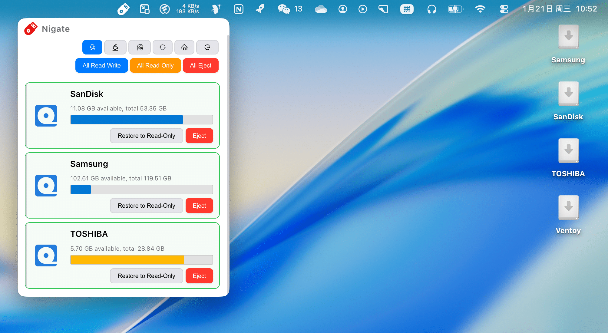

## Nigate

**语言 / Language / 言語**: [简体中文](README.zh-CN.md) | [English](README.md) | [日本語](README.ja.md)


这是 Nigate 的 Electron 图形界面版本，在保留原有命令行工具的基础上，为 NTFS 设备管理提供现代、直观的操作界面。[^1]

### 功能特性

- 🎨 **现代化界面**：采用简洁美观的深色主题
- 📱 **实时监控**：自动检测 NTFS 设备连接
- ✅ **依赖检查**：自动检查并安装所需的系统依赖
- 🔄 **一键挂载**：轻松将只读 NTFS 设备挂载为读写模式
- ⚡ **自动读写**：启用后，新接入的 NTFS 设备会自动以读写模式挂载；对于手动设置为只读的设备会智能跳过，尊重用户选择
- 📊 **状态显示**：清晰显示设备状态和操作日志
- 🛡️ **安全可靠**：遵循 Electron 安全最佳实践，并提供非破坏性的磁盘修复**重置**按钮
- ☕ **防止休眠**：一键阻止系统休眠，确保长时间操作期间系统保持唤醒
- 🍃 **状态保护**：长按 3 秒切换保护状态。启用保护后，自动读写、托盘模式和防止休眠功能将被禁用，以避免误操作
- 🥷 **忍者工具集**：提供跨文件系统挂载及从开发到发布的端到端脚本，并通过一键权限修复和多语言输出简化复杂操作
- 💻 **支持 Apple Silicon**：面向 Apple Silicon Mac（arm64）构建

### 重要说明

> [!CAUTION]
> 本软件的稳定运行和数据完整性取决于存储设备的性能。为避免数据读写错误、传输中断或设备识别失败，建议使用采用高质量闪存芯片且读写性能可靠的 USB 存储设备。

> [!important]
> **读写说明**：
> - **基本操作**：支持文件复制、剪切、删除和重命名等操作（元数据级操作）
> - **编辑与保存**：GUI 会以读写模式挂载 NTFS 卷，并将文件所有者映射到当前 macOS 用户的 `uid` / `gid`。在已测试的配置中，文本和图片可以编辑并保存；但兼容性可能因编辑器和具体保存操作而异
> - **保存失败时**：请提前备份重要数据。可将文件复制到 Mac 本地编辑，再复制回设备。通过临时文件创建并重命名替换的编辑器在某些情况下可能有帮助，但不能保证绕过所有限制
> - **补充说明**：忍者工具集 `/ninja/kamui.sh` 支持直接修改原文件内容，适用于需要直接编辑文件的场景 [^2]

- **管理员权限**：挂载操作需要管理员权限，系统会提示输入密码
- **Windows 快速启动**：如果设备曾在启用快速启动的 Windows 系统中使用，挂载可能失败。建议在 Windows 中完全关机（而非休眠），或关闭快速启动
- **设备名称**：USB 存储设备名称不支持空格和非法字符
- **Gatekeeper（允许任何来源）**：首次运行未签名应用时，可能需要调整 Gatekeeper 设置。可在终端运行 `sudo spctl --master-disable`；调整后，可在“系统设置”>“隐私与安全性”中查看“任何来源”选项
- **系统完整性保护（SIP，可选）**：如需关闭 SIP，必须进入 macOS 恢复模式：
  1. 重启 Mac，按住电源按钮，直到出现 Apple 标志和进度条，然后进入恢复模式
  2. 在屏幕顶部工具栏中打开“终端”，运行 `csrutil disable`
  3. 关闭终端并重启 Mac
  4. 重启后可在终端运行 `csrutil status` 查看状态
- **可启动 USB 设备**：如果 USB 设备曾用于制作 Ventoy、微 PE 等启动介质，以读写模式挂载时可能需要等待一段时间

### 快速开始

#### 方法一：在线使用（命令行忍者工具集）

以下脚本来自 `ninja/` 目录中的忍者工具集，可通过命令行支持 NTFS 和 Linux 文件系统读写。

**🌍 所有脚本均支持多语言！** 可通过 `LANG=ja` 或 `LANG=zh` 设置语言。

##### NTFS 读写支持

将以下命令复制到具有完整管理员权限的终端中并执行：

```shell
# English (default)
/bin/bash -c "$(curl -fsSL https://cdn.statically.io/gh/hoochanlon/Free-NTFS-for-Mac/main/ninja/nigate.sh)"

# 日本語
LANG=ja /bin/bash -c "$(curl -fsSL https://cdn.statically.io/gh/hoochanlon/Free-NTFS-for-Mac/main/ninja/nigate.sh)"

# 简体中文
LANG=zh /bin/bash -c "$(curl -fsSL https://cdn.statically.io/gh/hoochanlon/Free-NTFS-for-Mac/main/ninja/nigate.sh)"
```

##### Linux ext4 等文件系统读写支持

支持 ext2/3/4、btrfs、xfs、zfs、NTFS、exFAT、LUKS 加密、LVM、RAID 等多种文件系统：

```shell
# English (default)
/bin/bash -c "$(curl -fsSL https://cdn.statically.io/gh/hoochanlon/Free-NTFS-for-Mac/main/ninja/kamui.sh)"

# 日本語
LANG=ja /bin/bash -c "$(curl -fsSL https://cdn.statically.io/gh/hoochanlon/Free-NTFS-for-Mac/main/ninja/kamui.sh)"

# 简体中文
LANG=zh /bin/bash -c "$(curl -fsSL https://cdn.statically.io/gh/hoochanlon/Free-NTFS-for-Mac/main/ninja/kamui.sh)"
```

#### 方法二：下载到本地（命令行忍者工具集）

下载后可直接输入 `nigate` 启动：

```shell
curl https://fastly.jsdelivr.net/gh/hoochanlon/Free-NTFS-for-Mac/ninja/nigate.sh > ~/Public/nigate.sh && sudo mkdir -p /usr/local/bin && cd /usr/local/bin && sudo ln -s ~/Public/nigate.sh nigate.shortcut && echo "alias nigate='bash nigate.shortcut'" >> ~/.zshrc && osascript -e 'tell application "Terminal" to do script "nigate"'
```

#### 方法三：图形界面版（Electron）

从 [发布标签](https://github.com/hoochanlon/Free-NTFS-for-Mac/tags) 下载并使用。

- **🌍 应用界面支持多种语言**：简体中文、繁体中文、日语、英语、德语等

**托盘界面**



### 依赖管理

#### 一键安装依赖

```shell
# English (default)
/bin/bash -c "$(curl -fsSL https://cdn.jsdelivr.net/gh/hoochanlon/Free-NTFS-for-Mac@main/ninja/kunai.sh)"

# 日本語
LANG=ja /bin/bash -c "$(curl -fsSL https://cdn.jsdelivr.net/gh/hoochanlon/Free-NTFS-for-Mac@main/ninja/kunai.sh)"

# 简体中文
LANG=zh /bin/bash -c "$(curl -fsSL https://cdn.jsdelivr.net/gh/hoochanlon/Free-NTFS-for-Mac@main/ninja/kunai.sh)"
```

#### 一键卸载依赖

```shell
# English (default)
/bin/bash -c "$(curl -fsSL https://cdn.jsdelivr.net/gh/hoochanlon/Free-NTFS-for-Mac@main/ninja/ninpo.sh)"

# 日本語
LANG=ja /bin/bash -c "$(curl -fsSL https://cdn.jsdelivr.net/gh/hoochanlon/Free-NTFS-for-Mac@main/ninja/ninpo.sh)"

# 简体中文
LANG=zh /bin/bash -c "$(curl -fsSL https://cdn.jsdelivr.net/gh/hoochanlon/Free-NTFS-for-Mac@main/ninja/ninpo.sh)"
```

### 系统权限设置

配置系统权限和安全设置（Gatekeeper、SIP 等）：

```shell
# English (default)
/bin/bash -c "$(curl -fsSL https://cdn.jsdelivr.net/gh/hoochanlon/Free-NTFS-for-Mac@main/ninja/shuriken.sh)"

# 日本語
LANG=ja /bin/bash -c "$(curl -fsSL https://cdn.jsdelivr.net/gh/hoochanlon/Free-NTFS-for-Mac@main/ninja/shuriken.sh)"

# 简体中文
LANG=zh /bin/bash -c "$(curl -fsSL https://cdn.jsdelivr.net/gh/hoochanlon/Free-NTFS-for-Mac@main/ninja/shuriken.sh)"
```

更多信息请参阅：[忍者工具集测试 #39](https://github.com/hoochanlon/Free-NTFS-for-Mac/issues/39) 和[忍者工具集内容说明](docs/07-忍者工具集内容说明.md)。

### 运行与开发

### 🚀 一键运行（推荐新手使用）

**没有开发环境也可以一步部署！**

项目提供一键运行脚本，可自动检测并安装 Node.js、pnpm 和项目依赖，然后编译并启动应用。

#### 方法一：使用项目根目录脚本（推荐）

```bash
# 克隆项目
git clone <repository-url>
cd Free-NTFS-for-Mac

# 自动安装环境、编译并启动
./dev.sh
```

也可以运行 ninja 目录中的脚本：

```bash
./ninja/izanaki.sh
```

**脚本会自动完成：**
- ✅ 检测并安装 Node.js（如果尚未安装）
- ✅ 检测并安装 pnpm（如果尚未安装）
- ✅ 同步版本号
- ✅ 安装项目依赖
- ✅ 编译 TypeScript 代码
- ✅ 编译 Stylus 样式
- ✅ 启动应用（开发模式）

#### 方法二：手动安装（适合有经验的开发者）

1. **克隆并初始化项目**

```bash
git clone <repository-url>
cd Free-NTFS-for-Mac
pnpm install
```

2. **运行应用**

```bash
# 生产模式
pnpm start

# 开发模式（自动打开 DevTools）
pnpm run dev
```

3. **构建应用**

```bash
pnpm run build
```

### 🌍 多语言支持

所有脚本和工具均支持通过 `LANG` 环境变量切换语言：

```bash
# English (default)
./dev.sh

# 日本語
LANG=ja ./dev.sh

# 简体中文
LANG=zh ./dev.sh
```

支持的脚本包括：
- `dev.sh` / `ninja/izanaki.sh`：一键运行脚本
- `ninja/kamui.sh`：Linux 文件系统挂载
- `ninja/nigate.sh`：NTFS 自动挂载
- `ninja/build.sh`：应用打包
- `ninja/shuriken.sh`：系统权限设置
- 以及忍者工具集中的其他脚本

#### 项目设置脚本

如果运行 `pnpm run dev` 时遇到错误，可运行设置脚本进行修复：

```bash
pnpm run setup
```

也可以直接运行：

```bash
./ninja/izanaki.sh
```

此脚本会自动：
- ✅ 检查所需文件是否存在
- ✅ 设置脚本执行权限
- ✅ 创建必要的目录结构
- ✅ 同步版本号
- ✅ 编译 TypeScript 和 Stylus
- ✅ 验证关键文件

构建完成后，可在 `dist` 目录中找到打包后的应用。

### macOS 打包说明

打包后会在 `dist` 目录中生成：
- **DMG 文件**：用于分发的安装包
- **ZIP 文件**：压缩后的应用程序包

其他说明：
- 使用 `./ninja/build.sh` 可进行更灵活的打包
- 首次运行可能需要右键应用并选择“打开”（受 macOS 安全限制）

### 故障排查

#### 挂载失败

1. 检查依赖是否已安装
2. 确认设备未被其他程序占用
3. 如果是 Windows 快速启动导致的问题，请在 Windows 中完全关闭设备

#### 依赖安装失败

1. 确认网络连接正常
2. 检查 Homebrew 是否正确安装
3. 必要时在终端中手动运行安装命令

#### 应用无法启动

1. 检查 Node.js 版本是否满足要求
2. 删除 `node_modules` 后重新运行 `pnpm install`
3. 检查控制台错误信息

### 致谢

感谢所有为本项目贡献代码、测试和反馈的开发者与用户！详情请参阅 [致谢名单](ACKNOWLEDGMENTS.md)。

[^1]: **注意**：使用本工具挂载或修改 NTFS 设备存在数据丢失风险。操作前强烈建议备份重要数据。本工具按“现状”提供，不作任何保证；开发者不对使用本工具造成的数据丢失负责。

[^2]: 基于 [nohajc/anylinuxfs](https://github.com/nohajc/anylinuxfs) 进行二次封装。
