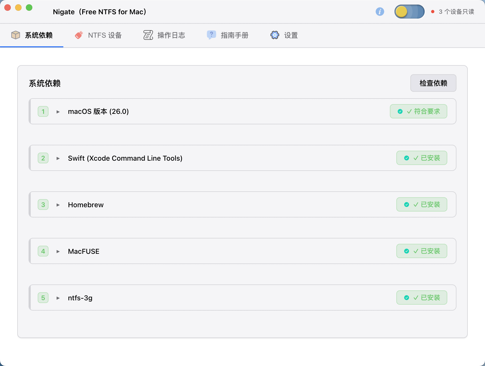
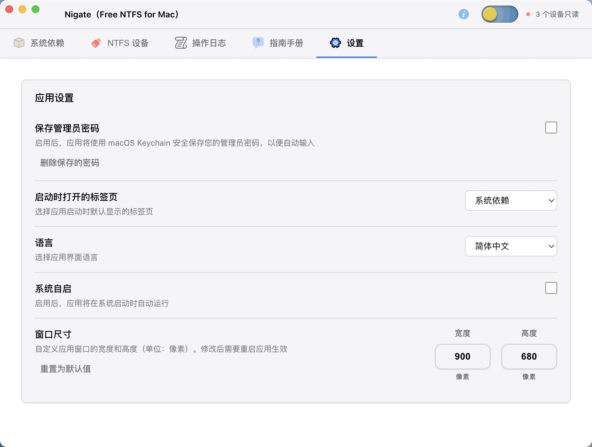

# Nigate 使用说明

## 软件介绍

**Nigate（Free NTFS for Mac）** 是一款免费的 macOS NTFS 读写工具。

简单来说，它的作用就是：**让你在 Mac 上像用普通 U 盘一样，正常读写 NTFS 格式的移动硬盘和 U 盘**。不用再折腾复杂的命令行，也不用安装那些体积庞大的商业软件。

软件界面简洁明了，上面是功能标签，下面是内容区域，插上设备就能看到，操作起来非常简单。

---

## 主要功能

自动识别设备：插上 NTFS 格式的移动硬盘或 U 盘后，软件会自动检测并显示在列表中。每个设备都会显示名称、容量、使用情况等信息。

一键改为可读写：Mac 默认只能读取 NTFS 设备，不能写入。用这个软件，点击"配置为可读写"按钮，输入一次管理员密码，就能正常拷贝、修改、删除文件了。

实时显示容量，每个设备都会显示容量条，一眼就能看出还剩多少空间：
- 蓝色：空间充足（使用率低于 80%）
- 黄色：空间紧张（使用率 80% 以上）
- 红色：空间不足（使用率 90% 以上）

自动读写模式：勾选"自动读写"后，以后插上的 NTFS 设备会自动以可读写方式挂载，不用每次都点按钮了。

不想一直开着主窗口，可以开启托盘模式：
- 关闭主窗口后，图标会留在右上角菜单栏
- 点击图标就能打开小窗口，直接操作各个磁盘
- 小窗口会根据设备数量自动调整大小，不会占太多屏幕空间

---

## 界面说明

打开软件后看到的就是主界面，上面有 5 个标签页：

- **系统依赖** - 检查软件运行需要的环境（第一次用建议看看）
- **NTFS 设备** - 这里显示所有插上的 NTFS 设备（主要功能）
- **操作日志** - 记录软件的操作历史（出问题时可以看看）
- **指南手册** - 使用帮助文档
- **设置** - 软件的各种设置选项

右上角还有：
- 主题切换按钮（深色/浅色模式）
- 关于按钮（查看软件信息）






## 日常使用

**开启自动读写模式：**

如果经常要用 NTFS 设备，建议开启"自动读写"：
1. 在"NTFS 设备"页面顶部，勾选"自动读写"
2. 以后插上设备就会自动变成可读写模式，不用每次都点按钮了

**使用托盘模式：**

如果不想一直开着主窗口：
1. 勾选"托盘模式"
2. 关闭主窗口后，软件会缩小到右上角菜单栏
3. 需要时点击菜单栏图标就能快速操作

**批量操作：**

如果同时插了多个设备：
- 点击"全读写"可以一次性把所有设备改成可读写
- 点击"全推出"可以一次性安全退出所有设备

---

## 重要提示与故障排除

### ⚠️ 系统兼容性警告

本软件依赖 **MacFUSE** 内核扩展来实现 NTFS 文件系统支持。在较新的 macOS 版本（特别是 macOS Sequoia 15.0 及以上）可能会出现兼容性问题。

**如果遇到系统崩溃（Kernel Panic）或重启：**

1. **立即停止使用**：如果系统出现崩溃，请暂时停止使用本软件
2. **安全退出设备**：重启后，确保所有 NTFS 设备都已安全退出
3. **检查 MacFUSE 版本**：在终端运行 `brew info macfuse` 查看当前版本
4. **更新 MacFUSE**：尝试更新到最新版本：
   ```bash
   brew update
   brew upgrade --cask macfuse
   ```
5. **检查系统日志**：查看系统日志中是否有相关错误信息

### 常见问题

**Q: 系统出现内核崩溃，是否与软件有关？**

A: 如果崩溃日志中显示 `io.macfuse.filesystems.macfuse` 或 `IOMediaBSDClient` 相关的超时错误，很可能与 MacFUSE 相关。建议：
- 暂时卸载 MacFUSE：`brew uninstall --cask macfuse`
- 等待 MacFUSE 发布针对新 macOS 版本的更新
- 或考虑使用其他 NTFS 解决方案

**Q: 如何安全退出 NTFS 设备？**

A: 在软件中点击"推出"按钮，或使用系统自带的"推出"功能。**不要直接拔掉设备**，这可能导致数据丢失或系统问题。

**Q: 设备读写速度很慢？**

A: 这是 FUSE 文件系统的正常现象，因为数据需要通过用户空间传输。如果速度过慢，可能是设备本身的问题。

---

## 下载地址

**GitHub Releases**:

https://github.com/hoochanlon/Free-NTFS-for-Mac/releases/tag/v1.3


